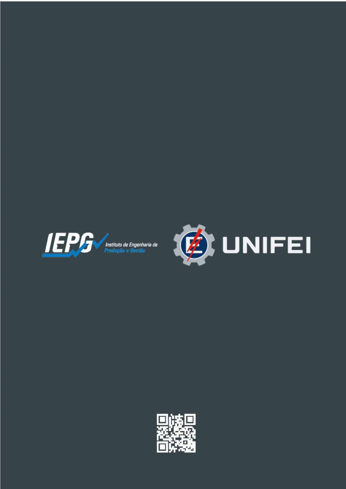

# INTRODUÇÃO

A UNIFEI, com sede na cidade de Itajubá, sul de Minas Gerais, foi fundada em 23 de novembro de 1913, sendo a décima escola de Engenharia a se instalar no país. Em 2013 comemorou 100 anos de história com mais de 30 cursos de graduação, 26 de pós-graduação, cerca de 8.500 alunos e uma forte ligação com o universo da ciência, tecnologia, inovação e empreendedorismo.

Com um histórico em desenvolvimento de ferramentas educacionais, a UNIFEI vai além de, simplesmente, incentivar e inspirar os alunos, mas, na oferta permanente e constante do acesso às ferramentas necessárias para o avanço e necessidade da humanidade. O Bacharelado em Ciência de Dados Aplicada, ofertado pelo Instituto de Engenharia de Produção e Gestão (IEPG), nasce em um contexto global marcado pela crescente centralidade dos dados como insumo estratégico para a tomada de decisão, modelagem de cenários, automação inteligente e inovação em praticamente todos os setores da economia. 

A ciência de dados consolidou-se como um campo interdisciplinar que integra estatística, computação, gestão, métodos quantitativos e conhecimento setorial, permitindo transformar grandes volumes de dados em informações relevantes, modelos preditivos e soluções aplicadas. A UNIFEI, instituição de excelência em engenharia e tecnologia há mais de um século, possui um ecossistema acadêmico e científico especialmente favorável ao desenvolvimento de um curso desse tipo. Os laboratórios institucionais, os centros de inovação, as parcerias estratégicas com indústria, governo e setor de serviços, além do ambiente empreendedor consolidado na cidade de Itajubá, oferecem as condições ideais para formação de profissionais altamente qualificados.

O curso foi concebido para atender às demandas contemporâneas de diversos setores — como saúde, energia, esportes, finanças, petróleo e gás, manufatura avançada, agricultura e setor público — que enfrentam desafios complexos e crescentes relacionados à análise de dados, inteligência artificial, governança e segurança informacional. A proposta de Ciência de Dados Aplicada diferencia-se ao enfatizar a aplicação prática dos métodos e tecnologias de dados em problemas reais enfrentados pelas organizações, com foco no impacto social, econômico e tecnológico.

O curso também se alinha às Diretrizes Curriculares Nacionais da área de Computação e às políticas institucionais da UNIFEI, incluindo o Plano de Desenvolvimento Institucional (PDI), que destaca a relevância estratégica das áreas de tecnologia da informação, inovação e transformação digital.

Dessa forma, o Bacharelado em Ciência de Dados Aplicada busca formar profissionais capazes de atuar em todo o ciclo de vida dos dados — desde a coleta, organização, limpeza e exploração, até o desenvolvimento de modelos preditivos, soluções inteligentes e análises interpretáveis. A formação ancora-se em sólidos fundamentos estatísticos, computacionais e metodológicos, integrados a competências de comunicação, ética, governança e visão sistêmica.

Alguns resultados importantes já foram alcançados pela instituição em relação à Inteligência Artificial. Em 2021, a UNIFEI firmou um convênio com o ICTP-Trieste, um instituto de pesquisa italiano, para desenvolvimento da Tiny Machine Learning, uma ferramenta de aprendizado de máquina para sistemas embarcados. A instituição também tem sido pioneira no desenvolvimento de algoritmos com vários registros de softwares no INPI desenvolvidos por grupos de pesquisas. Um deles foi o primeiro algoritmo de Inteligência Artificial para otimização multi-objetivo do Brasil e resultou no prêmio CAPES de Teses em 2023. 

Algumas características do curso de Ciência de Dados Aplicada merecem ser destacadas, pois a proposta tem como objetivo formar um profissional capaz de integrar engenharia, dados, automação e inteligência artificial em soluções reais de alto impacto, articulando competências técnicas, analíticas e empreendedoras. 

Uma das principais inovações do curso será o incentivo à adoção sistemática de projetos integradores que utilizam dados e problemas reais. Esses projetos permitem que os estudantes construam pipelines de dados reprodutíveis, executem experimentos de machine learning com rastreabilidade, integrem soluções com sistemas OT/IT, desenvolvam interfaces operacionais e apresentem resultados técnicos e de negócio com métricas claras. 

Além de seu caráter aplicado, tais projetos têm natureza extensionista, articulando-se diretamente com demandas de organizações, instituições públicas, empresas locais e desafios regionais. Dessa forma, o curso reforça seu compromisso com o impacto regional, contribuindo para o desenvolvimento de soluções reais e socialmente relevantes. Os projetos integradores também se conectam às trilhas temáticas — Saúde, Esporte e Gestão — permitindo que os estudantes apliquem conhecimentos técnicos em contextos concretos desses setores, favorecendo uma aprendizagem orientada por problemas e desafios reais.

As trilhas, por sua vez, constituem outro diferencial importante do curso. Elas ampliam a autonomia do estudante, permitindo que personalize sua trajetória acadêmica e se especialize em áreas estratégicas de aplicação da ciência de dados. Ao alinhar conteúdos técnicos a setores específicos, as trilhas fortalecem a interdisciplinaridade, aproximam o aluno de temas contemporâneos e ampliam sua capacidade de atuação em diferentes mercados. Trata-se de um componente estrutural que diferencia o curso pela combinação entre rigor técnico, contextualização prática e relevância social.

# HISTÓRICO DE CRIAÇÃO

O Bacharelado em Ciência de Dados Aplicada começou a ser planejado no primeiro semestre de 2023 com a criação da trilha de Machine Learning em Engenharia de Produção. Tendo convergência entre o PDI da UNIFEI (inovação curricular, integração graduação–pós e foco em Indústria 4.0) e a maturidade do Programa de Pós-Graduação em Engenharia de Produção (PPGEP - Conceito CAPES 5), especialmente na linha “Modelagem, Otimização e Controle”. Diante da conversão das expertises dos resultados das pesquisas do programa de pós-graduação em engenharia de produção, apoiada pela infraestrutura do NOMATI.

Assim a criação do curso de Ciência de Dados Aplicada responde à convergência de quatro vetores: (i) adoção acelerada de tecnologias 4.0 (IA/ML, automação avançada, sistemas ciberfísicos, IoT, analytics em nuvem e DevOps) como base da competitividade; (ii) forte demanda de mercado e escassez de profissionais com competências integradas em dados, software, processos e gestão da mudança (WEF 2023); (iii) oportunidade institucional de diferenciar a graduação, reverter evasão e elevar empregabilidade por meio de uma formação orientada a projetos reais; e (iv) capacidade instalada na UNIFEI/PPGEP e no NOMATI (pesquisa aplicada, laboratórios e docência) que permite escalar iniciativas existentes (como a trilha de ML) para uma matriz abrangente que integra IA aplicada, automação e engenharia de dados aos conhecimentos técnicos da engenharia de produção e além. 

Assim, o curso alinha-se ao PDI, atende às exigências industriais por transformação digital end-to-end e consolida a UNIFEI como referência nacional na formação para a Indústria 4.0. 

O Bacharelado em Ciência de Dados Aplicada ainda não foi aprovado pelo Conselho Universitário da UNIFEI.

# ESTRUTURA ADMINISTRATIVA 

O Bacharel em Ciência de Dados Aplicada, do Campus de Itajubá da UNIFEI, que será responsável pela gestão dos recursos humanos alocados para o curso, será alocado no IEPG e contará com o apoio do NOMATI. 

Das disciplinas a serem oferecidas no curso 100% serão alocadas ao IEPG, sendo 47% já existentes e 53% a serem criadas.

Dados cadastrais:

-	**Ao final do curso o aluno terá o Grau de Bacharel em Ciência de Dados Aplicada**.

-	**Código de cadastro e-mec**: *ainda não tem*.

-	**Carga horária do curso**: 3.213 horas/aula.

-	**Duração prevista em semestres**:  mínima 7 (sete), esperada 8 (oito) e máxima 15 (quinze).

-	**Turno**: noturno.

-	**Primeira oferta do curso**: segundo semestre de 2026.

-	**Total de vagas para primeira oferta**: 40 vagas por ano.

-	**Forma de ingresso**: prioritariamente pelo SISU – Sistema de Seleção Unificado, que utiliza as notas do ENEM.

```{=latex}
\begin{center}
```


```{r, echo=FALSE, fig.align='center', results='asis'}

library(magrittr)

ch <- readxl::read_xlsx(path = 'ch_01.xlsx', sheet = 'ch_total')

knitr::kable(ch) 
```

```{=latex}
\end{center}
```


# JUSTIFICATIVA DO CURSO

O curso de Ciências de Dados Aplicados surge como uma resposta às necessidades crescentes do mercado e da sociedade. A seguir, apresenta-se algumas justificativas que sustentam essa demanda:

1. **Crescimento do Mercado de Dados**

  - Aumento da Geração de Dados: Com a digitalização e a transformação digital, há um volume exponencial de   dados sendo gerados diariamente. Empresas e organizações precisam de profissionais capacitados para coletar,   analisar, interpretar e suportar tomada de decisões estratégicas com esses dados.

  -	Demanda por Profissionais Qualificados: Segundo estudos de mercado, a demanda por cientistas de dados e   analistas de dados tem crescido rapidamente, com uma escassez de profissionais qualificados para preencher   essas vagas.

2. **Relevância para Diversos Setores**

  -	Interdisciplinaridade: A ciência de dados é aplicável em diversas áreas, como saúde, finanças, educação,   marketing e meio ambiente. Isso torna os profissionais formados em Ciências de Dados Aplicados versáteis e   altamente valorizados no mercado.

  -	Soluções Baseadas em Dados: Organizações estão cada vez mais buscando soluções baseadas em dados para     melhorar processos, otimizar recursos e inovar em produtos e serviços.

3. **Impacto Social e Comunitário**

  -	Resolução de Problemas Sociais: Profissionais de ciência de dados podem contribuir para a solução de       problemas sociais, como a análise de dados em saúde pública, segurança, educação e sustentabilidade.

  -	Apoio à Tomada de Decisão: A capacidade de transformar dados em insights acionáveis pode melhorar a        tomada de decisão em políticas públicas e iniciativas comunitárias.

4. **Formação Integrada e Prática**

  -	Educação Prática: O curso de Ciências de Dados Aplicados pode incluir experiências práticas, como          estágios e projetos de extensão, que permitem aos alunos aplicar conhecimentos teóricos em situações reais,   aumentando sua empregabilidade.

  -	Desenvolvimento de Soft Skills: Além das habilidades técnicas, o curso pode desenvolver competências       interpessoais, como trabalho em equipe, comunicação e pensamento crítico, essenciais no ambiente             profissional.

5. **Inovação e Empreendedorismo**

  -	Fomento à Inovação: A formação em ciências de dados estimula a inovação, permitindo que os alunos          desenvolvam novas soluções e abordagens para problemas existentes, o que pode levar à criação de startups e   novos negócios.

  -	Apoio ao Empreendedorismo: Os conhecimentos adquiridos podem ser aplicados em projetos próprios,           capacitando os alunos a se tornarem empreendedores no campo da tecnologia e análise de dados.
  
# OBJETIVOS DO CURSO

## Missão

O curso de Ciência de Dados Aplicada tem como missão formar profissionais altamente capacitados para atuar na análise e interpretação de dados, utilizando técnicas avançadas de Machine Learning e estatística. Buscamos desenvolver competências que permitam aos alunos transformar dados em informações estratégicas, contribuindo para a tomada de decisões em diversos setores da economia. Nossa abordagem interdisciplinar integra fundamentos de engenharia, computação e ciências sociais, promovendo uma formação ética e crítica, capaz de responder aos desafios contemporâneos da sociedade e do mercado de trabalho.

## Objetivo geral

Capacitar os estudantes a desenvolver, implementar e avaliar soluções analíticas baseadas em dados, com ênfase em técnicas de Machine Learning e estatística. O curso visa formar profissionais que sejam capazes de transformar dados brutos em informações úteis, contribuindo para a tomada de decisões estratégicas em diversas áreas, como negócios, saúde, educação e tecnologia. Além disso, busca-se promover uma formação crítica e ética, preparando os alunos para enfrentar os desafios sociais e éticos relacionados ao uso de dados.

## Objetivos específicos

1.	Desenvolver Competências Técnicas: Capacitar os alunos a utilizar ferramentas e técnicas de análise de dados, incluindo estatísticas descritivas, inferenciais e algoritmos de Machine Learning, para resolver problemas práticos.

2.	Implementar Projetos de Dados: Ensinar os alunos a planejar, implementar e avaliar projetos de ciência de dados, desde a coleta e pré-processamento de dados até a modelagem e interpretação dos resultados.

3.	Promover a Interdisciplinaridade: Integrar conhecimentos de diferentes áreas, como computação, estatística e ciências sociais, para que os alunos possam abordar problemas complexos de forma holística.

4.	Fomentar a Ética e a Responsabilidade Social: Sensibilizar os alunos sobre as implicações éticas do uso de dados, promovendo uma formação que valorize a privacidade, a justiça e a transparência nas análises.

5.	Preparar para o Mercado de Trabalho: Proporcionar experiências práticas e estágios que preparem os alunos para atuar em diversos setores, como saúde, finanças, tecnologia e educação, atendendo às demandas do mercado.

6.	Estimular a Pesquisa e a Inovação: Incentivar a realização de projetos de pesquisa que explorem novas técnicas e abordagens em ciência de dados, contribuindo para o avanço do conhecimento na área.

7.	Desenvolver Habilidades de Comunicação: Capacitar os alunos a comunicar resultados e insights de forma clara e eficaz, utilizando visualizações de dados e relatórios que atendam às necessidades de diferentes públicos.

Esses objetivos específicos visam garantir uma formação completa e adequada às exigências do mercado e às necessidades da sociedade.

# PERFIL DO INGRESSANTE

As formas de acesso ao curso de Ciência de Dados podem variar de acordo com a instituição, mas geralmente incluem:

1.	Vestibular: Processo seletivo tradicional onde os candidatos realizam provas de conhecimentos gerais e específicos.

2.	Exame Nacional do Ensino Médio (ENEM): Utilização da nota do ENEM como critério de seleção para ingresso no curso, comum em muitas universidades brasileiras.

3.	Transferência: Possibilidade de alunos de outras instituições de ensino superior solicitarem transferência para o curso, mediante análise de histórico escolar e adequação curricular.

4.	Reingresso: Para alunos que já foram matriculados em cursos da mesma instituição e desejam retornar ao curso de Ciência de Dados.

Por sua vez, o perfil do ingressante no curso de Ciência de Dados geralmente inclui:

1.	Formação Prévia: Candidatos com formação em áreas como Matemática, Estatística, Computação, Engenharia, ou áreas afins são frequentemente bem-vindos, mas não é uma exigência exclusiva.

2.	Interesse em Tecnologia e Dados: Um forte interesse por tecnologia, análise de dados e resolução de problemas complexos.

3.	Habilidades Analíticas: Capacidade de pensar criticamente e analisar informações quantitativas e qualitativas.

4.	Interesse em Programação: Familiaridade com linguagens de programação como Python ou R pode ser uma vantagem, embora não seja sempre um requisito.

5.	Perfil Proativo: Disposição para aprender continuamente e se adaptar às novas tecnologias e metodologias no campo da ciência de dados.

6.	Trabalho em Equipe: Habilidade de trabalhar colaborativamente em projetos, uma vez que muitas atividades envolvem equipes multidisciplinares.

# NÚCLEO DOCENTE ESTRUTURANTE

De acordo com o Parecer CONAES n. 4/2010, o Núcleo Docente Estruturante (NDE) visa qualificar a participação docente na concepção e consolidação de cursos de graduação. Segundo a legislação da Comissão Nacional de Avaliação da Educação Superior (2010), o NDE deve ser composto por docentes com atribuições acadêmicas, atuando na elaboração, consolidação e atualização contínua do Projeto Pedagógico do Curso (PPC).

Conforme a Resolução CONAES n. 1/2010, os membros do NDE devem ter liderança acadêmica, reconhecida pela produção de conhecimento e desenvolvimento do ensino na área. O NDE não é um órgão deliberativo, mas serve como espaço para discutir atividades pedagógicas e acadêmicas, garantindo que ensino, pesquisa e extensão sejam realizadas de forma adequada.

Segundo o Regimento Geral da Unifei, as atribuições do NDE são:

1. Elaborar, acompanhar a execução e atualizar periodicamente o PPC e a estrutura curricular e disponibilizá-lo ao colegiado do curso para deliberação;

2. Contribuir para a consolidação do perfil profissional do egresso do curso;

3. Zelar pela integração curricular interdisciplinar entre as diferentes atividades de ensino constantes no PPC;

4. Indicar formas de incentivo ao desenvolvimento de linhas de pesquisa e atividades de extensão, oriundas de necessidades da graduação, de exigências do mercado de trabalho e afinadas com as políticas públicas relativas à área de conhecimento do curso;

5. Zelar pelo cumprimento das diretrizes curriculares nacionais para o curso de graduação e das normas internas da Unifei;

6. Propor ações a partir de resultados obtidos nos processos de avaliação internos e externos.

# COLEGIADO DO CURSO

O Colegiado do curso é responsável pela gestão do curso em parceria com a Pró-reitoria de Graduação. Segundo o Regimento Geral da Unifei, cada Colegiado deve ter entre cinco e dez membros, sendo que:

-	60% devem ser docentes responsáveis por disciplinas da área profissional do graduado;

-	Até 30% serão docentes de outras disciplinas;

-	Pelo menos um membro deve ser do corpo discente.

O Colegiado, que segue normas específicas do Regimento Geral, reúne-se ordinariamente duas vezes por semestre e extraordinariamente quando convocado, caso dois terços dos membros solicitem a reunião. O mandato dos docentes é de dois anos, com possibilidade de recondução, enquanto os discentes têm mandato de um ano, também com recondução permitida. 

Os procedimentos para a eleição dos membros serão definidos em norma aprovada pela Câmara Superior de Graduação.

Segundo o Regimento Geral da Unifei, compete ao Colegiado de Curso:

1. Eleger o Coordenador de Curso;
2. Propor nomes para comporem o NDE, encaminhando à Assembleia da Unidade para aprovação;
3. Deliberar sobre o PPC, encaminhando à Assembleia da Unidade para aprovação;
4. Promover a implementação do PPC;
5. Aprovar alterações nos planos de ensino das disciplinas propostos pelo NDE;
6. Elaborar e acompanhar o processo de avaliação e renovação de reconhecimento do curso;
7. Estabelecer mecanismos de orientação acadêmica ao corpo discente do curso;
8. Criar comissões para assuntos específicos;
9. Designar coordenadores de Trabalho de Conclusão de Curso, Estágio, Mobilidade Acadêmica e Atividades Complementares;
10. Analisar e emitir parecer sobre aproveitamento de estudos e adaptações, de acordo com norma específica aprovada pela Câmara Superior de Graduação;
11. Julgar, em grau de recurso, as decisões do Coordenador do Curso;
12. Decidir ou opinar sobre outras matérias pertinentes ao curso.

# COORDENADOR DO CURSO

O artigo 162 do Regimento Geral da Unifei determina que o Coordenador de Curso terá um mandato de 2 (dois) anos e será eleito pelo respectivo Colegiado do Curso, por maioria simples e em escrutínio único havendo um Coordenador Adjunto ou um substituto indicado pelo Coordenador eleito, /entre os membros do Colegiado do Curso, que terá como atribuição substituir o Coordenador em suas ausências ou impedimentos.

A atuação do coordenador do curso obedece ao que estabelece o Regimento Geral da Unifei.
Compete ao coordenador do curso:
1. Convocar e presidir as reuniões do Colegiado de Curso, com direito, somente, ao voto de qualidade;
2. Representar o Colegiado de Curso;
3. Supervisionar o funcionamento do curso;
4. Tomar medidas necessárias para a divulgação do curso;
5. Participar da elaboração do calendário didático da graduação;
6. Promover reuniões de planejamento do curso;
7. Orientar os alunos do Curso na matrícula e na organização e seleção de suas atividades curriculares;
8. Decidir sobre assuntos da rotina administrativa do curso;
9. Exercer outras atribuições inerentes ao cargo.

# PERFIL DO EGRESSO

O egresso do Bacharelado em Ciência de Dados Aplicada da UNIFEI será um profissional com formação sólida, interdisciplinar e orientada para a aplicação prática da ciência de dados em diferentes setores da sociedade. A formação proporcionada pelo curso enfatiza competências analíticas, computacionais, matemáticas, estatísticas, éticas e gerenciais, preparando o futuro profissional para atuar em ambientes dinâmicos, complexos e baseados em dados.

O egresso estará apto a compreender e conduzir todas as etapas do ciclo de vida dos dados — desde a aquisição, organização, limpeza, armazenamento e processamento, até a análise exploratória, modelagem, validação, interpretabilidade, comunicação dos resultados e auxílio à tomada de decisão. Será capaz de propor soluções e estratégias orientadas por dados em contextos reais, considerando impactos sociais, econômicos, tecnológicos e ambientais.

## Competências Técnicas

Ao concluir o curso, o egresso estará apto a:

-	Aplicar métodos estatísticos e matemáticos avançados em problemas complexos;
-	Desenvolver sistemas, modelos e algoritmos de aprendizado de máquina e inteligência artificial;
-	Projetar e gerenciar pipelines de dados, considerando escalabilidade, segurança e governança;
-	Dominar linguagens de programação utilizadas na ciência de dados (como Python);
-	Projetar e consultar bases de dados SQL e NoSQL;
-	Realizar análise exploratória de dados e visualização avançada para suporte à decisão;
-	Integrar ferramentas de big data, computação em nuvem e sistemas distribuídos;
-	Desenvolver soluções completas de MLOps, acompanhando modelos do desenvolvimento à produção.

## Competências Analíticas e Cognitivas

-	 Estruturar problemas complexos de forma sistemática e orientada ao método científico; 
-	Avaliar criticamente resultados de modelos, métricas e evidências quantitativas;
-	Interpretar fenômenos por meio de dados e propor recomendações fundamentadas; 
-	Comunicar resultados técnicos e analíticos para diferentes públicos, técnicos ou não técnicos.


## Competências Sociais, Éticas e Profissionais

-	Atuar com responsabilidade ética no uso de dados, respeitando a legislação (incluindo LGPD); 
-	 Avaliar impactos sociais e organizacionais decorrentes do uso de dados e IA;
-	Trabalhar de forma colaborativa em equipes multidisciplinares; 
-	Demonstrar autonomia intelectual, criatividade e capacidade de aprendizagem contínua.

## Áreas de Atuação do Egresso

O profissional formado poderá atuar em diferentes setores, incluindo:

-	Esportes (análise de desempenho, biomecânica, predição de performance);
-	Saúde (análise de prontuários, modelos preditivos, diagnósticos assistidos); 
-	Finanças (modelagem de risco, detecção de fraudes, algoritmos de investimento); 
-	Indústria 4.0 (otimização, monitoramento inteligente, manutenção preditiva); 
-	Energia e Sustentabilidade (previsão de demanda, eficiência energética, análise ambiental); 
-	Petróleo e Gás (modelagem geológica, otimização de processos);
-	Governo e Setor Público (políticas públicas baseadas em evidências, segurança pública); 
-	Agricultura de Precisão (modelagem climática, análise de solo, previsão de safra); 
-	Comércio e Marketing (segmentação, análise de consumidores, estratégias orientadas a dados).

## Síntese do Perfil Profissional

O egresso será um cientista de dados capaz de atuar em diferentes contextos e setores, articulando conhecimentos técnicos e visão sistêmica para resolver problemas reais. Será um profissional preparado para lidar com desafios atuais e futuros relacionados à transformação digital, contribuindo para a inovação, competitividade e desenvolvimento sustentável das organizações e da sociedade.

# POLÍTICAS INSTITUCIONAIS

## Política de ensino

As políticas institucionais da Universidade Federal de Itajubá (UNIFEI) são fundamentais para garantir um ambiente acadêmico de qualidade, inclusivo e voltado para o desenvolvimento integral dos estudantes. Neste contexto, a política de ensino se destaca pela busca constante de inovação nas metodologias pedagógicas e pela promoção de um currículo que atenda às demandas do mercado e da sociedade. Sendo constituída pelos eixos:

-	Qualidade Acadêmica: A UNIFEI busca garantir a qualidade do ensino por meio de um currículo atualizado, que atenda às demandas do mercado e da sociedade.
-	Metodologias Ativas: Incentivo ao uso de metodologias ativas de ensino-aprendizagem que promovam a participação ativa dos alunos e a construção do conhecimento.
-	Inclusão e Diversidade: Compromisso com a inclusão social e a diversidade, garantindo acesso e permanência de todos os estudantes, especialmente grupos historicamente marginalizados.

## Programa de atendimento ao corpo discente

O programa de atendimento ao discente é estruturado para oferecer suporte psicológico, acadêmico e financeiro, assegurando que todos os alunos tenham condições adequadas para o seu aprendizado e desenvolvimento. Sendo pautado nas ações de:

-	Apoio Psicossocial: Disponibilização de serviços de apoio psicológico e social para auxiliar alunos em dificuldades acadêmicas ou pessoais.
-	Tutoria Acadêmica: Programas de tutoria que conectam alunos veteranos com ingressantes, proporcionando orientação e suporte acadêmico.
-	Bolsas e Auxílios: Oferecimento de bolsas de estudo e auxílios financeiros para estudantes em situação de vulnerabilidade econômica.

## Políticas e ações de acompanhamento dos egressos

A UNIFEI valoriza o acompanhamento dos egressos, reconhecendo a importância de entender suas trajetórias profissionais e a contribuição que a formação acadêmica oferece em suas vidas. Sendo desenvolvidas ações de:

-	Monitoramento de Egressos: Implementação de sistemas para acompanhar a trajetória profissional dos egressos, coletando dados sobre sua inserção no mercado de trabalho.
-	Feedback e Melhoria Contínua: Uso das informações coletadas para aprimorar os cursos e programas acadêmicos, garantindo que atendam às necessidades do mercado.
-	Rede de Egressos: Criação de uma rede de contatos entre egressos e a universidade, facilitando a troca de experiências e oportunidades de colaboração. 
Com destaque para o papel da Fundação Theodomiro Santiago (FTS) mantém um forte vínculo com ex-alunos da antiga EFEI (atual UNIFEI), que historicamente contribuíram como fundadores, colaboradores e membros. Atualmente, a relação se concretiza através de eventos, homenagens e a participação ativa dos ex-alunos em órgãos como a assembleia da fundação. A FTS organiza atividades que promovem o reencontro e a troca de experiências entre gerações de ex-alunos. 

## Comunicação da UNIFEI com a comunidade interna e externa

A comunicação com a comunidade interna e externa é um pilar essencial, promovendo a transparência e o engajamento entre a universidade e a sociedade. Assim, as políticas institucionais da UNIFEI refletem seu compromisso com a excelência acadêmica e a responsabilidade social. Esta comunicação é pautada:

-	Transparência e Abertura: Compromisso com a transparência nas decisões e processos administrativos, promovendo uma comunicação clara e acessível.
-	Eventos e Atividades: Realização de eventos, palestras e workshops que envolvem a comunidade interna e externa, promovendo a troca de conhecimentos.
-	Canais de Comunicação: Utilização de diversas plataformas (site institucional, redes sociais, newsletters) para manter a comunidade informada sobre atividades, conquistas e oportunidades.

# REQUISITOS LEGAIS 

## Condições de Acesso para Pessoas com Deficiência e/ou Mobilidade Reduzida

A Universidade Federal de Itajubá (UNIFEI) adota uma série de medidas para garantir o acesso e a permanência de pessoas com deficiência e/ou mobilidade reduzida em suas atividades acadêmicas. Essas condições são fundamentais para promover a inclusão e a igualdade de oportunidades para todos os estudantes. A seguir, destacam-se algumas das principais iniciativas:

- **Acessibilidade Física**
  -	Infraestrutura Adaptada: A universidade conta com rampas de acesso, elevadores e banheiros adaptados, garantindo que todos os espaços físicos sejam acessíveis.
  -	Sinalização: A sinalização adequada em braille e com contrastes visuais é implementada para facilitar a locomoção de pessoas com deficiência visual.

- **Apoio Acadêmico**
  -	Atendimento Especializado: Disponibilização de serviços de apoio psicológico e pedagógico, com profissionais capacitados para atender às necessidades específicas dos alunos.
  -	Materiais Acessíveis: Produção de materiais didáticos em formatos acessíveis, como audiobooks e textos em braille, para atender a diferentes tipos de deficiência.

- **Políticas de Inclusão**
  -	Formação e Capacitação: Realização de treinamentos para professores e funcionários sobre inclusão e acessibilidade, visando sensibilizar a comunidade acadêmica sobre as necessidades dos estudantes com deficiência.
  -	Programas de Apoio: Implementação de programas de tutoria e mentorias específicas para alunos com deficiência, ajudando na adaptação ao ambiente acadêmico.

- **Comunicação e Sensibilização**
  -	Campanhas de Conscientização: Promoção de eventos e campanhas que visam sensibilizar a comunidade acadêmica sobre a importância da inclusão e do respeito às diferenças.
  -	Canal de Comunicação: Disponibilização de um canal direto para que alunos com deficiência possam relatar dificuldades e sugerir melhorias nas condições de acesso.
Essas iniciativas refletem o compromisso da UNIFEI em promover um ambiente inclusivo, onde todos os estudantes, independentemente de suas condições, possam ter acesso igualitário à educação e às oportunidades oferecidas pela universidade.

## Disciplina Optativa de Libras

A Universidade Federal de Itajubá (UNIFEI) oferece uma disciplina de Língua Brasileira de Sinais (Libras) classificada como optativa. Essa iniciativa é parte do compromisso da instituição em promover a inclusão e a acessibilidade para pessoas surdas e com deficiência auditiva. Esta oferta atende ao decreto número 5.626, de 22 de dezembro de 2005.

# LEGISLAÇÃO ESPECÍFICA

O Bacharelado em Ciência de Dados Aplicada atende a todas as legislações específicas comuns a todos os cursos de graduação, conforme apresentado a seguir.

```{=latex}
\begin{center}
```


```{r, echo=FALSE, fig.align='center', results='asis'}

library(magrittr)

ch <- readxl::read_xlsx(path = 'ch_01.xlsx', sheet = 'legislacao')

knitr::kable(ch) 
```


```{=latex}
\end{center}
```


A disciplina Ciência de Dados e Sociedade atende:

-	Lei 11.645 de 10/03/2008; Resolução CNE/CP 01 de 17 de junho de 2004 é prevista a oferta de disciplinas eletivas sobre a referida temática, bem como incentivada a participação de alunos em eventos que tratam da mesma. 
-	Resolução CNE n. 1, de 30 de maio de 2012 voltado à Educação em Direitos Humanos e a adesão da Unifei ao Pacto Nacional para a Educação em Direitos Humanos que também aborda a questão da diversidade social, cultural, racial. O Pacto Universitário pela Promoção do Respeito à Diversidade, da Cultura da Paz e dos Direitos Humanos é uma iniciativa conjunta do Ministério da Educação e do Ministério da Justiça e Cidadania para a promoção da educação em direitos humanos no ensino superior.
-	Políticas de Educação Ambiental, destacadas na Lei n. 9.795, de 27 de abril de 1999 e Decreto n. 4.281, de 25 de junho de 2002. Bem como  o Plano de Gestão e Logística Sustentável (PLS): Atendendo a Instrução Normativa 10/12, do Ministério de Planejamento, Orçamento e Gestão (MPOG) para as Instituições Federais de Ensino Superior foi criado o PLS da Instituição através de um grupo de trabalho coordenado por professores, alunos e técnicos;
-	Resolução CNE/CP n° 01, de 17 de junho de 2004 que aborda o ensino de história e cultura afro-brasileira, africana e indígena. 


# FUNDAMENTOS DIÁTICO-PEDAGÓGICOS

O novo curso da Universidade Federal de Itajubá (UNIFEI) é fundamentado em princípios didáticos e pedagógicos que visam promover uma educação de qualidade, inclusiva e voltada para as demandas contemporâneas. A seguir, destacam-se os principais aspectos que norteiam essa proposta educacional:

1. **Abordagem Interdisciplinar**:
A formação busca integrar diferentes áreas do conhecimento, permitindo que os alunos desenvolvam uma compreensão holística dos temas abordados. Essa abordagem favorece a construção de saberes que dialogam entre si, preparando os estudantes para enfrentar desafios complexos no mundo real.

2. **Educação Inclusiva**:
Um dos pilares do curso é a promoção da inclusão e da diversidade. As disciplinas de Libras e Ciência de Dados e Sociedade são fundamentais para garantir que os alunos se sintam respeitados e valorizados, independentemente de suas origens ou condições. Isso envolve um currículo inclusivo que cria um ambiente escolar acolhedor e equitativo.

3. **Metodologias Ativas**:
O uso de metodologias ativas é incentivado, estimulando a participação dos alunos no processo de aprendizagem. Através de práticas como debates, trabalhos em grupo e projetos, os estudantes são encorajados a se tornarem protagonistas de sua formação, desenvolvendo habilidades críticas e reflexivas.

4. **Formação para a Cidadania**:
O curso tem um forte compromisso com a formação de cidadãos conscientes e engajados. Os alunos são incentivados a refletir sobre sua responsabilidade social e a atuar em prol de uma sociedade mais justa e sustentável, contribuindo para a transformação social.

5. **Integração Teoria-Prática**:
A articulação entre teoria e prática é essencial na formação dos alunos. O curso propõe experiências práticas que complementam a teoria, permitindo que os estudantes vivenciem e apliquem os conhecimentos adquiridos em situações reais.
Os fundamentos didáticos e pedagógicos do novo curso da UNIFEI refletem um compromisso com a excelência educacional e a formação integral dos alunos. Ao promover uma educação inclusiva, interdisciplinar e voltada para a cidadania, a UNIFEI se posiciona como uma instituição que valoriza a diversidade e a responsabilidade social, preparando seus alunos para os desafios vindouros.

## Princípios didáticos-metodológicos

Os princípios didático-metodológicos do curso têm por base as diretrizes do Plano de Desenvolvimento Institucional e do Projeto Pedagógico Institucional da Universidade Federal de Itajubá. A prática docente fundamenta-se no respeito à pluralidade de concepções pedagógicas e na autonomia do docente para o planejamento didático, desde que atendidas as diretrizes previstas neste documento.

## Estratégias de aprendizagem

As estratégias de aprendizagem implementadas no novo curso da Universidade Federal de Itajubá (UNIFEI) são projetadas para promover um ambiente educacional dinâmico e eficaz. Abaixo estão algumas das principais estratégias adotadas:

- **Aprendizagem Baseada em Projetos (ABP)**
  - Descrição: Os alunos trabalham em projetos práticos que refletem problemas reais, incentivando a aplicação do conhecimento teórico em situações concretas.
  - Objetivo: Desenvolver habilidades práticas, pensamento crítico e capacidade de resolução de problemas.

- **Estudos de Caso**
  - Descrição: Análise de casos reais ou hipotéticos que desafiam os alunos a aplicar conceitos aprendidos e a desenvolver soluções.
  - Objetivo: Estimular a reflexão crítica e a discussão, promovendo uma compreensão mais profunda dos conteúdos.

- **Aprendizagem Colaborativa**
  - Descrição: Os alunos são incentivados a trabalhar em grupos, compartilhando conhecimentos e experiências para alcançar objetivos comuns.
  - Objetivo: Fomentar habilidades sociais, como comunicação e trabalho em equipe, essenciais para o ambiente profissional.

- **Uso de Tecnologias Educacionais**
  - Descrição: Integração de ferramentas digitais e plataformas de aprendizado online para complementar as aulas e facilitar o acesso a recursos educacionais.
  - Objetivo: Modernizar o ensino e proporcionar flexibilidade na aprendizagem, permitindo que os alunos aprendam no seu próprio ritmo.

- **Feedback Contínuo**
   - Descrição: Avaliações formativas e feedback regular são fornecidos aos alunos para ajudá-los a identificar áreas de melhoria e a monitorar seu progresso.
   - Objetivo: Promover uma aprendizagem reflexiva e contínua, onde os alunos possam ajustar suas estratégias de estudo conforme necessário.

- **Mentoria e Acompanhamento**
   - Descrição: Alunos têm acesso a mentores e tutores que oferecem orientação acadêmica e profissional, ajudando-os a navegar por suas trajetórias educativas.
   - Objetivo: Apoiar o desenvolvimento pessoal e acadêmico, garantindo que os alunos se sintam apoiados em sua jornada.

### Acessibilidade Metodológica

A acessibilidade metodológica é um aspecto crucial na educação, especialmente em instituições como a Universidade Federal de Itajubá (UNIFEI). Ela visa garantir que todos os alunos, independentemente de suas condições físicas, sensoriais ou cognitivas, tenham igual acesso ao aprendizado e às atividades acadêmicas. Aqui estão os principais pontos sobre a acessibilidade metodológica na UNIFEI:

- **Adaptação Curricular**
  - Descrição: O currículo é adaptado para atender às necessidades de todos os alunos, incluindo aqueles com deficiências.
  - Objetivo: Garantir que todos possam participar plenamente das atividades acadêmicas, sem barreiras.

- **Uso de Recursos Tecnológicos**
  - Descrição: Ferramentas e tecnologias assistivas são incorporadas ao ambiente de aprendizagem, como softwares de leitura de tela e legendas em vídeos.
  - Objetivo: Facilitar a comunicação e o acesso ao conteúdo para alunos com diferentes necessidades.

- **Formação de Professores**
  - Descrição: Capacitação contínua dos docentes para que possam identificar e atender às necessidades de alunos com deficiência.
  - Objetivo: Sensibilizar e preparar os professores para implementar práticas inclusivas em suas aulas.

- **Ambientes Acessíveis**
  - Descrição: As instalações físicas da universidade são projetadas ou adaptadas para serem acessíveis, incluindo rampas, sinalização adequada e banheiros adaptados.
  - Objetivo: Criar um espaço seguro e inclusivo para todos os alunos.

- **Apoio Psicológico e Acadêmico**
  - Descrição: Disponibilização de serviços de apoio psicológico e tutoria acadêmica para auxiliar alunos com dificuldades específicas.
  - Objetivo: Oferecer suporte emocional e acadêmico, promovendo a permanência e o sucesso dos alunos.

- **Feedback e Avaliação Inclusiva**
  - Descrição: Métodos de avaliação são diversificados para acomodar diferentes estilos de aprendizagem e necessidades.
  - Objetivo: Garantir que todos os alunos possam demonstrar seu conhecimento e habilidades de maneiras que sejam justas e acessíveis.

A acessibilidade metodológica na UNIFEI é um compromisso com a inclusão e a equidade educacional. Ao implementar essas práticas, a Universidade busca não apenas atender às exigências legais, mas também promover um ambiente de aprendizado onde todos os alunos possam prosperar. Essa abordagem reflete uma visão mais ampla de educação, que valoriza a diversidade e a participação de todos.

### Autonomia Discente

A autonomia discente é um conceito fundamental no ambiente educacional, especialmente na Universidade Federal de Itajubá (UNIFEI). Refere-se à capacidade dos alunos de gerenciar sua própria aprendizagem, tomar decisões sobre seu percurso acadêmico e desenvolver habilidades críticas e reflexivas. Aqui estão os principais aspectos da autonomia discente na UNIFEI:

- **Promoção da Autonomia na Aprendizagem**
  - Descrição: A UNIFEI incentiva os alunos a se tornarem protagonistas de sua própria aprendizagem, promovendo a reflexão sobre seus métodos de estudo e a busca por conhecimentos de forma independente.
  - Objetivo: Fomentar um aprendizado ativo e responsável, onde os alunos se sintam empoderados para buscar informações e soluções.

- **Metodologias Ativas**
  - Descrição: A utilização de metodologias ativas, como aprendizagem baseada em projetos e estudos de caso, permite que os alunos participem ativamente do processo de ensino-aprendizagem.
  - Objetivo: Estimular a iniciativa dos alunos, promovendo a colaboração e a troca de experiências, além de desenvolver habilidades práticas.

- **Orientação e Apoio**
  - Descrição: Professores e tutores oferecem orientação, mas incentivam a busca de soluções pelos próprios alunos, criando um ambiente de suporte que valoriza a independência.
  - Objetivo: Equilibrar o suporte acadêmico com a necessidade de os alunos tomarem decisões e resolverem problemas de forma autônoma.

- **Avaliação Formativa**
  - Descrição: A avaliação é estruturada para fornecer feedback contínuo, permitindo que os alunos identifiquem suas fortalezas e áreas de melhoria.
  - Objetivo: Incentivar a autoavaliação e a reflexão crítica sobre o próprio desempenho, promovendo um aprendizado mais consciente.

- **Desenvolvimento de Habilidades Sociais e Emocionais**
  - Descrição: A autonomia discente também envolve o desenvolvimento de habilidades sociais, como trabalho em equipe e comunicação, que são essenciais para o sucesso acadêmico e profissional.
  - Objetivo: Preparar os alunos para interações eficazes em ambientes colaborativos, tanto na universidade quanto no mercado de trabalho.

- **Flexibilidade Curricular**
  - Descrição: A UNIFEI oferece opções de eletivas e atividades extracurriculares que permitem aos alunos personalizar seu percurso acadêmico de acordo com seus interesses e objetivos.
  - Objetivo: Facilitar a exploração de diferentes áreas do conhecimento, promovendo um aprendizado mais alinhado com as aspirações individuais.

A autonomia discente na UNIFEI é essencial para a formação de profissionais críticos e preparados para enfrentar os desafios do mundo contemporâneo. Ao promover um ambiente que valoriza a independência e a responsabilidade, a universidade não apenas enriquece a experiência acadêmica, mas também contribui para o desenvolvimento integral dos discentes.

# SISTEMA DE AVALIAÇÃO

## Avaliação do discente

O sistema de avaliação do discente na Universidade Federal de Itajubá (UNIFEI) é projetado para medir o desempenho acadêmico dos alunos de forma justa e abrangente. A seguir, estão os principais componentes desse sistema:

- **Avaliação Formativa**
  -	Descrição: A avaliação formativa é contínua e busca acompanhar o progresso do aluno ao longo do semestre. Inclui atividades como trabalhos, projetos e apresentações.
  -	Objetivo: Proporcionar feedback constante, permitindo que os alunos identifiquem suas dificuldades e fortalezas.

- **Avaliação Somativa**
  -	Descrição: Realizada ao final de cada período letivo, a avaliação somativa geralmente consiste em provas e exames que medem o conhecimento adquirido pelos alunos.
  -	Objetivo: Determinar a aprovação ou reprovação do aluno em uma disciplina, com base no desempenho global.

- **Diversificação dos Instrumentos de Avaliação**
  -	Descrição: A UNIFEI utiliza uma variedade de métodos de avaliação, incluindo:
  -	Provas escritas
  -	Trabalhos em grupo
  -	Relatórios de pesquisa
  -	Projetos práticos
  -	Objetivo: Atender diferentes estilos de aprendizagem e proporcionar oportunidades para que todos os alunos demonstrem seu conhecimento.

- **Critérios de Avaliação Claros**
  -	Descrição: Os critérios de avaliação são definidos previamente e comunicados aos alunos, garantindo transparência e equidade no processo avaliativo.
  -	Objetivo: Permitir que os alunos saibam exatamente o que é esperado deles e como serão avaliados.


- **Autoavaliação e Reflexão**
  -	Descrição: Os alunos são incentivados a realizar autoavaliações, refletindo sobre seu próprio aprendizado e progresso.
  -	Objetivo: Promover a autonomia e a responsabilidade pelo próprio aprendizado.

- **Consideração de Aspectos Qualitativos**
  -	Descrição: Além das notas, aspectos qualitativos como participação em aula, colaboração em grupo e engajamento em atividades extracurriculares também são considerados na avaliação.
  -	Objetivo: Valorizar a formação integral do aluno, indo além do desempenho acadêmico estrito.

O sistema de avaliação do discente na UNIFEI é estruturado para ser inclusivo, reflexivo e adaptável às necessidades dos alunos. Ele busca não apenas medir o conhecimento, mas também promover o desenvolvimento de habilidades críticas e sociais, preparando os alunos para os desafios do mercado de trabalho e da vida profissional. Essa abordagem integrada assegura que a avaliação contribua efetivamente para o processo de aprendizagem.

## Avaliação externa à universidade

As avaliações externas são estabelecidas pelo Sistema Nacional de Avaliação da Educação Superior (SINAES) instituído pela Lei 10.861, de 14 de abril de 2004. Sendo os principais aspectos relacionados às avaliações externas no contexto do SINAES:

- **Objetivos do SINAES**
  -	Avaliação da Qualidade: O SINAES tem como objetivo principal assegurar a qualidade da educação superior, avaliando tanto as instituições quanto os cursos oferecidos.
  -	Transparência e Melhoria: Promover a transparência nas informações sobre as instituições e incentivar a melhoria contínua da qualidade educacional.
- **Componentes do SINAES**
  -	Avaliação Institucional: Envolve a análise da gestão, infraestrutura, corpo docente e a adequação dos recursos disponíveis para o ensino.
  -	Avaliação de Cursos: Avalia a qualidade dos cursos oferecidos, considerando aspectos como currículo, metodologias de ensino e resultados de aprendizagem.
  -	Avaliação do Desempenho dos Estudantes: Inclui a análise do desempenho acadêmico dos alunos, medido por meio de exames e outras avaliações.
- **Instrumentos de Avaliação**
  -	Visitas In Loco: Avaliadores do Ministério da Educação (MEC) realizam visitas às instituições para verificar as condições de ensino e infraestrutura.
  -	Relatórios de Autoavaliação: As instituições são incentivadas a elaborar relatórios que reflitam sua autoavaliação, destacando pontos fortes e áreas que necessitam de melhoria.
  -	Exames e Testes: Utilização de exames como o ENADE (Exame Nacional de Desempenho de Estudantes) para avaliar o conhecimento dos alunos em relação aos conteúdos dos cursos.
- **Resultados e Consequências**
  -	Classificação das Instituições: Os resultados das avaliações podem impactar a classificação das instituições no cenário nacional, influenciando a percepção pública e a captação de alunos.
  -	Apoio e Recursos: Instituições com melhor desempenho podem ter acesso a mais recursos e apoio do governo para programas de melhoria.
  -	Planos de Ação: Instituições que não atingem os padrões de qualidade estabelecidos são incentivadas a desenvolver planos de ação para corrigir deficiências.
- **Importância da Avaliação**
  -	Melhoria Contínua: As avaliações externas são fundamentais para o processo de melhoria contínua da qualidade da educação superior, permitindo que as instituições se adaptem às necessidades do mercado e da sociedade.
  -	Responsabilidade Social: As instituições são responsabilizadas pela formação de profissionais competentes, contribuindo para o desenvolvimento social e econômico do país.

O SINAES desempenha um papel crucial na garantia da qualidade da educação superior no Brasil, incluindo a UNIFEI. As avaliações externas não apenas fornecem um diagnóstico da situação atual, mas também orientam as instituições na busca por melhorias contínuas, alinhando-se às demandas da sociedade e do mercado de trabalho.

## Avaliação interna à universidade e do docente

A Universidade Federal de Itajubá (UNIFEI) implementa diversos mecanismos de avaliação interna para garantir a qualidade dos cursos oferecidos e o desempenho dos discentes. Esses mecanismos são fundamentais para promover a melhoria contínua e a adequação às diretrizes do SINAES. A seguir estão os principais aspectos:

- **Autoavaliação Institucional**
  -	Descrição: A UNIFEI realiza processos de autoavaliação periódicos, onde a instituição analisa seus próprios métodos, resultados e práticas acadêmicas.
  -	Objetivo: Identificar pontos fortes e áreas que necessitam de melhorias, promovendo um ciclo de feedback que contribua para o aprimoramento da qualidade educacional.

- **Avaliação de Cursos**
  -	Descrição: Cada curso é avaliado em relação a critérios específicos, que incluem a qualidade do corpo docente, infraestrutura, currículo, e a adequação das metodologias de ensino.
  -	Objetivo: Garantir que os cursos atendam às necessidades dos alunos e do mercado de trabalho, além de promover a atualização constante dos conteúdos.

- **Comissão de Avaliação**
  -	Descrição: A UNIFEI conta com comissões internas que são responsáveis por realizar avaliações sistemáticas dos cursos e da instituição como um todo.
  -	Objetivo: Propor melhorias e acompanhar a implementação de ações corretivas com base nos resultados das avaliações.

- **Feedback dos Alunos**
  -	Descrição: Os alunos são incentivados a fornecer feedback sobre as disciplinas, professores e a infraestrutura da universidade.
  -	Objetivo: Coletar informações valiosas que ajudem na identificação de problemas e na formulação de estratégias para melhorias.

- **Relatórios de Desempenho**
  -	Descrição: A instituição elabora relatórios que analisam o desempenho acadêmico dos alunos, levando em consideração taxas de aprovação, retenção e conclusão.
  -	Objetivo: Monitorar a eficácia dos métodos de ensino e identificar tendências que possam indicar a necessidade de intervenções.

- **Integração com o SINAES**
  -	Descrição: A avaliação interna está alinhada com os critérios e diretrizes do SINAES, assegurando que a UNIFEI atenda aos padrões de qualidade exigidos pelo Ministério da Educação (MEC).
  -	Objetivo: Facilitar a preparação para avaliações externas e garantir a conformidade com as normas nacionais de educação superior.

- **Ações de Melhoria Contínua**
  -	Descrição: Com base nas avaliações e feedbacks, a UNIFEI implementa ações de melhoria contínua que podem incluir capacitação de docentes, revisão de currículos e melhorias na infraestrutura.
  -	Objetivo: Promover um ambiente educacional que favoreça a aprendizagem e o desenvolvimento integral dos alunos.

Os mecanismos de avaliação interna da UNIFEI são essenciais para assegurar a qualidade da educação oferecida. Eles não apenas ajudam a identificar áreas de melhoria, mas também garantem que a universidade se mantenha alinhada às melhores práticas e exigências do setor educacional, promovendo a formação de profissionais qualificados e preparados para o mercado de trabalho.

# ALINHAMENTO AO PDI

O Plano de Desenvolvimento Institucional (PDI) da Universidade Federal de Itajubá (UNIFEI) estabelece diretrizes e políticas que orientam a gestão acadêmica e administrativa da instituição. No âmbito dos cursos oferecidos, a implementação dessas políticas é fundamental para garantir a qualidade do ensino e a formação integral dos alunos. A seguir estão os principais aspectos relacionados à implementação das políticas do PDI no contexto dos cursos da UNIFEI:

- **Objetivos do PDI**
  -	Qualidade Acadêmica: As políticas do PDI visam garantir a excelência acadêmica, promovendo a formação de profissionais competentes e éticos.
  -	Inclusão e Acessibilidade: O PDI enfatiza a importância de políticas de inclusão, buscando atender a grupos historicamente marginalizados e garantindo acessibilidade a todos os alunos.

- **Desenvolvimento Curricular**
  -	Revisão e Atualização de Currículos: Os cursos devem passar por revisões periódicas para se manterem atualizados em relação às demandas do mercado de trabalho e às inovações na área de conhecimento.
  -	Integração de Conhecimentos: O PDI propõe a integração entre teoria e prática, incentivando a realização de estágios e atividades práticas que complementem a formação teórica.

- **Formação e Capacitação de Docentes**
  -	Programas de Capacitação: O PDI inclui ações voltadas para a formação continuada dos docentes, visando melhorar as metodologias de ensino e a abordagem pedagógica.
  -	Avaliação de Desempenho: A avaliação do desempenho docente é uma prática constante, com feedbacks que visam a melhoria contínua da qualidade do ensino.

- **Gestão de Recursos e Infraestrutura**
  -	Investimentos em Infraestrutura: O PDI prevê investimentos em laboratórios, bibliotecas e outros recursos que suportem a formação dos alunos.
  -	Gestão Eficiente: A gestão dos recursos deve ser feita de maneira eficiente, assegurando que os alunos tenham acesso a condições adequadas para o aprendizado.

- **Avaliação e Monitoramento**
  -	Avaliações Periódicas: O PDI estabelece que os cursos devem ser avaliados regularmente, utilizando indicadores de desempenho que permitam monitorar a qualidade do ensino e a satisfação dos alunos.
  -	Feedback dos Alunos: A coleta de feedback dos alunos é incentivada, permitindo que a instituição identifique áreas que necessitam de melhorias.

- **Promoção da Pesquisa e Extensão**
  -	Integração entre Ensino, Pesquisa e Extensão: O PDI promove a relação entre ensino, pesquisa e extensão, incentivando que os alunos participem de projetos de pesquisa e atividades de extensão que complementem sua formação.
  -	Financiamento de Projetos: A UNIFEI busca recursos para financiar projetos de pesquisa e extensão, promovendo a inovação e o desenvolvimento social.

A implementação das políticas institucionais do PDI da UNIFEI no âmbito dos cursos é essencial para garantir uma formação de qualidade, alinhada às necessidades da sociedade e do mercado de trabalho. Essas políticas não apenas promovem a excelência acadêmica, mas também asseguram que a universidade cumpra sua função social, contribuindo para a formação de cidadãos críticos e preparados para enfrentar os desafios contemporâneos.

# RECURSOS

## Corpo docente e técnico

O corpo docente da UNIFEI é constituído por 502 professores, dos quais 457 são doutores (91%) e 389 servidores técnico-administrativos em educação.

O Instituto de Engenharia de Produção e Gestão (IEPG), localizado no campus de Itajubá, que irá abrigar o curso de Ciência de Dados Aplicada, possui um corpo docente formado por 51 professores, dos quais 48 são doutores (94%). Para este novo curso será necessária a contratação de 14 (quatorze) novos docentes por meio de concurso público, de modo a atender a toda a sua grade curricular com novas disciplinas. As contratações são programadas para ingresso dos novos docentes considerando a implantação do curso:

-	Início do curso: 4 docentes
-	Primeiro ano após o início: 4 docentes
-	Segundo ano após o início: 3 docentes
-	Terceiro ano após o início: 3 docentes

## Apoio pedagógico 

O apoio pedagógico se dará em quatro frentes distintas:

-	Biblioteca física: Biblioteca Mauá (campus Itajubá). Além da biblioteca virtual de livros eletrônicos (Pearson, em português e inglês), Cengage Learning, acesso às Normas da ABNT e acesso ao Portal de Periódicos da Capes.
-	Maker space: onde os alunos podem prototipar suas ideias, em projetos de “mão na massa”.
-	Laboratórios: Inovação de Produtos e Inteligência Artificial, onde os alunos podem praticar o conteúdo visto em sala de aula, que ficam no prédio do grupo de pesquisa do Núcleo de Otimização da Manufatura e Tecnologia da Inovação (NOMATI). Esse prédio e os laboratórios entram como contrapartida da UNIFEI para a realização do novo curso.
-	Prédio do Centro de Empreendedorismo: o prédio foi construído e inaugurado no final de 2024 com recursos do Governo do Estado de Minas Gerais e ainda não foi ocupado. Possui uma área de aproximadamente 5.000 m2 e o curso e seus diferenciais acadêmicos e extensionistas serão realizados nesse local, inclusive os novos professores contratados terão seus gabinetes no prédio, que acomodará novos laboratórios para uso pelos alunos do curso e com a comunidade do município, em especial, alunos dos cursos fundamental II e médio das escolas públicas estaduais e municipais, que irão interagir com os projetos de competição tecnológica, empresas juniores, alunos de graduação, visando melhorar a formação desses jovens e já familiarizá-los com o ambiente universitário, de modo que tenham em seus planos fazer um curso superior, em especial, o novo curso de Ciência de Dados Aplicada (ou outro curso oferecido pela UNIFEI). Essa será mais uma contrapartida da UNIFEI para a realização do novo curso.

## Apoio aos discentes 

A UNIFEI possui programa de iniciação científica que conta com cotas de bolsas do PIBIC/CNPq, do PIBIC/FAPEMIG, além de bolsas da própria instituição.

A Universidade possui, ainda, 10 (dez) programas PETs/CAPES em atividade, além de Empresas Juniores e vários projetos de competição tecnológica. Dois desses programas PET são de cursos de graduação do IEPG e atuam com empreendedorismo e inovação. Além deles, o IEPG conta com uma empresa júnior dos cursos de Engenharia de Produção, Administração e Design (futuramente, os discentes do curso de Ciência de Dados Aplicada irão poder fazer parte dessa empresa júnior, uma das maiores da Universidade em termos de faturamento por conta dos serviços prestados).

Essa gama toda de atividades extracurriculares pode ser disponibilizada também para os discentes do Curso de Engenharia em Transformação Digital, propiciando uma formação bastante diversificada, propiciando ao discente oportunidades de praticarem o conteúdo aprendido em sala de aula em diversos projetos de competição ou extensão tecnológica.
Some-se a isso tudo o Centro de Empreendedorismo UNIFEI (CEU) do campus de Itajubá que, juntamente com a incubadora de empresas de base tecnológica localizada dentro do campus de Itajubá, proporcionam ambientes favoráveis ao desenvolvimento das habilidades para empreender, essenciais para o sucesso do curso, uma vez que os discentes podem desenvolver soluções para empresas e para o mercado, estas últimas na forma de abertura de startups que serão concebidas no Centro de Empreendedorismo e, posteriormente, incubadas na Incubadora de Base Tecnológica de Itajubá (INCIT), uma das maiores incubadoras de Minas Gerais, com prêmios nacionais recebidos por seus resultados.

## Cooperações e parcerias

A UNIFEI mantém cooperação ativa com aproximadamente 80 instituições universitárias estrangeiras, distribuídas em 22 países da Europa, América do Norte, América do Sul, América Central, Ásia e África, ampliando oportunidades de internacionalização, mobilidade acadêmica e participação em projetos multidisciplinares de alto impacto. 
A tradição centenária da UNIFEI em engenharias, aliada ao histórico de parcerias com grandes empresas como Petrobras, 

Vale, Cemig, Embraer e diversas indústrias de base tecnológica, cria um ecossistema ideal para projetos reais, estágios, pesquisa aplicada e desenvolvimento de soluções. Além disso, o município de Itajubá conta atualmente com um robusto ecossistema de inovação, denominado de Itajubá Hardtech, premiado em 2023 como o melhor ecossistema de inovação para cidades de médio porte (CNI/SEBRAE). Esse ecossistema possui diversas demandas que os alunos do novo curso podem atender, melhorando sua formação acadêmica, no formato hands-on.

O curso de Ciência de Dados Aplicada será naturalmente integrado às atividades do IEPG e NOMATI, possibilitando vivência prática em pesquisa aplicada, inovação aberta, desenvolvimento de produtos e participação em desafios industriais. Essas cooperações fortalecem a formação do estudante e garantem que o curso se mantenha conectado às demandas reais da Indústria 4.0 e dos setores emergentes.

# ESTRUTURA CURRICULAR

A estrutura curricular do Bacharelado em Ciência de Dados Aplicada foi organizada de forma a garantir a formação integral do estudante, combinando fundamentos teóricos, habilidades práticas aplicadas a uma trilha de conhecimento. O curso possui 8 períodos, com carga horária total aproximada de 3.213 horas.aula, conforme normas institucionais da UNIFEI. Todas as disciplinas são organizadas a partir de três eixos formativos que se articulam ao longo dos semestres, permitindo ao estudante avançar de fundamentos conceituais para aplicações especializadas:

1. **Núcleo de Conteúdos Básicos e Técnicos**

Compreende as disciplinas fundamentais de matemática, estatística, computação, ciência de dados, engenharia de dados e machine learning. Abrange todas as disciplinas obrigatórias ofertadas entre o primeiro e o sexto semestre, e fornece a base conceitual e prática sobre a qual se estruturam as trilhas aplicadas e os projetos integradores. Esse núcleo consolida as competências analíticas, computacionais e metodológicas essenciais ao cientista de dados.

2. **Disciplinas Aplicadas às Trilhas Temáticas**

O curso oferece três trilhas de especialização — Saúde, Esporte e Gestão — nas quais os estudantes aplicam os conhecimentos básicos e técnicos a contextos reais.
As trilhas incluem:

- Componentes obrigatórios vinculados aos Projetos Integradores (PI 1 no quarto semestre e PI 2 no sexto semestre), nos quais problemas reais das trilhas são estruturados e solucionados.

- Componentes optativos, cursados no sétimo semestre, dos quais o estudante deve cumprir no mínimo 12 horas-aula em três disciplinas, completando uma trilha com cinco disciplinas aplicadas ao tema escolhido.

Esse eixo promove a contextualização prática dos conteúdos técnicos, o desenvolvimento de soluções orientadas por dados e a formação por áreas de interesse.

3. **Disciplinas Complementares de Gestão**

Reúne componentes obrigatórios voltados à formação em gestão empresarial, gestão da produção e inovação, essenciais para profissionais que atuarão na interface entre análise de dados, processos organizacionais e decisões estratégicas.
São componentes deste eixo: Gestão Ágil de Projetos, Planejamento e Controle da Produção, Indústria 4.0, Engenharia da Qualidade, Engenharia Econômica e Criação de Negócio.

Essas disciplinas são ofertadas entre o primeiro e o sexto semestre e visam desenvolver competências gerenciais necessárias para a viabilização de soluções, produtos, startups e aplicações resultantes dos conteúdos técnicos e das trilhas.

```{=latex}
\clearpage
\begin{landscape}
```

```{r echo=FALSE, fig.align='center', message=FALSE, warning=FALSE, results='asis'}

library(magrittr)

library(readxl)
library(knitr)
library(kableExtra)

ch <- read_xlsx(path = 'ch_01.xlsx', sheet = 'ch_semestre')

if (knitr::is_html_output()) {
  ch %>% 
    kable(format = "html",
          booktabs = FALSE, 
          col.names = c("Semestre 1",
                        "CH",
                        "Semestre 2",
                        "CH",
                        "Semestre 3",
                        "CH",
                        "Semestre 4",
                        "CH",
                        "Semestre 5",
                        "CH",
                        "Semestre 6",
                        "CH",
                        "Semestre 7",
                        "CH",
                        "Semestre 8",
                        "CH")) %>%
    kable_styling(full_width = FALSE, 
                  position = "center", 
                  font_size = 10) %>%
    scroll_box(width = "100%")
} else if (knitr::is_latex_output()) {
  kable(ch, 
        format = "latex", 
        booktabs = FALSE, 
        longtable = TRUE,
        col.names = c("Semestre 1",
                        "CH",
                        "Semestre 2",
                        "CH",
                        "Semestre 3",
                        "CH",
                        "Semestre 4",
                        "CH",
                        "Semestre 5",
                        "CH",
                        "Semestre 6",
                        "CH",
                        "Semestre 7",
                        "CH",
                        "Semestre 8",
                        "CH")) %>%
    kable_styling(position = "center", 
                  font_size = 9) %>% 
    column_spec(1, width = "2cm") %>% 
    column_spec(2, width = "0.3cm") %>% 
    column_spec(3, width = "2cm") %>% 
    column_spec(4, width = "0.3cm") %>% 
    column_spec(5, width = "2cm") %>% 
    column_spec(6, width = "0.3cm") %>% 
    column_spec(7, width = "2cm") %>% 
    column_spec(8, width = "0.3cm") %>% 
    column_spec(9, width = "2cm") %>% 
    column_spec(10, width = "0.3cm") %>% 
    column_spec(11, width = "2cm") %>% 
    column_spec(12, width = "0.3cm") %>% 
    column_spec(13, width = "2cm") %>% 
    column_spec(14, width = "0.3cm") %>% 
    column_spec(15, width = "2cm") %>% 
    column_spec(16, width = "0.3cm")
}
```

```{=latex}
\end{landscape}
\clearpage
```


Considerando os 8 semestres previstos para o curso, o currículo compreende 3.213 horas. Toda sua estrutura foi projetado de forma a balancear as várias unidades de estudo. A previsão é de haver entre 6 e 7 disciplinas por semestre. 

Com a finalidade de fortalecer a integração do estudante com os temas característicos da Administração e da Engenharia de Produção — áreas estruturantes do Instituto de Engenharia de Produção e Gestão (IEPG) — o curso adota como optativas todas as disciplinas optativas ofertadas pelos cursos de Administração e Engenharia de Produção. Além disso, no sétimo semestre o estudante deverá obrigatoriamente cursar ao menos uma disciplina optativa que não pertença às trilhas temáticas. Essa diretriz amplia sua vivência acadêmica para além do eixo técnico, estimula a transversalidade entre os cursos do instituto e promove uma formação interdisciplinar e aplicada, alinhada às demandas contemporâneas de profissionais capazes de articular conhecimentos de dados, gestão e processos organizacionais.

## Projeto Integrador

Os projetos integradores têm como foco a aplicação prática dos conhecimentos adquiridos ao longo do curso, promovendo a interdisciplinaridade e preparando os alunos para os desafios do mercado de trabalho. A participação em projetos reais também estimula o desenvolvimento de habilidades como trabalho em equipe, comunicação e resolução de problemas. Em ambas as disciplinas, os projetos são voltados ao desenvolvimento de atividades de extensão, o que demonstra a preocupação do PPC em introduzir de forma estruturada a extensão universitária na grade curricular, reforçando seu caráter formativo, social e aplicado.

- **Projeto Integrador 1 - Análise de dados em tempo real**: Esta disciplina tem por finalidade desenvolver um sistema que permita a coleta, análise e visualização de dados em tempo real, aplicando técnicas de ciência de dados e machine learning.

  - **Estrutura do Projeto**:

  -	Introdução: Contextualização do problema a ser resolvido e importância da análise de dados em tempo real em setores escolhidos pelos alunos de acordo com as trilhas de aprendizagem.
  -	Coleta de Dados: Definição das fontes de dados (APIs, sensores, bancos de dados).
  -	Processamento de Dados: Utilização de ferramentas como Python, R ou plataformas como Apache Kafka para o processamento em tempo real.
  -	Modelagem: Aplicação de algoritmos de machine learning para prever tendências ou comportamentos.
  -	Implementação: desenvolvimento do sistema de coleta e análise; criação de dashboards interativos utilizando ferramentas como Tableau ou Power BI.
  -	Resultados Esperados: relatório detalhando a eficiência do sistema e visualizações que demonstrem insights obtidos a partir dos dados analisados.
  -	Conclusão: reflexão sobre o aprendizado e a aplicabilidade do projeto no mercado de trabalho.
  -	Apresentação: apresentação oral do projeto para a turma e professores, com demonstração prática do sistema desenvolvido.

- **Projeto Integrador 2 - Soluções de Machine Learning**: Esta disciplina tem por objetivo criar uma solução que utilize machine learning para abordar um problema real específico da trilha de aprendizagem.

  - **Estrutura do Projeto**:
  
  -	Introdução: Identificação, justificativa e relevância do problema a ser abordado.
  -	Metodologia:
  -	Pesquisa e Levantamento de Dados: Coleta de dados relevantes (ex: dados de saúde, índices de criminalidade).
  -	Análise Exploratória: Uso de técnicas de visualização para entender os dados.
  -	Desenvolvimento do Modelo: Escolha do algoritmo apropriado (ex: regressão, classificação) e treinamento do modelo.
  -	Implementação: criação de um protótipo da solução, como um aplicativo ou uma plataforma web com integração do modelo de machine learning na solução proposta.
  -	Resultados Esperados: avaliação do modelo com métricas apropriadas (ex: precisão, recall) e impacto esperado da solução no problema social identificado.
  -	Conclusão: discussão sobre os desafios enfrentados durante o desenvolvimento e possíveis melhorias.
  -	Apresentação: apresentação do projeto, destacando a importância da ciência de dados na solução de problemas sociais e a eficácia da solução proposta.

## Trabalho de Conclusão de Curso

O Trabalho de Conclusão de Curso (TCC) é uma etapa fundamental na formação dos alunos da Universidade Federal de Itajubá (UNIFEI). Ele representa a culminação do aprendizado e a aplicação prática dos conhecimentos adquiridos ao longo do curso. A seguir, são apresentados os principais aspectos relacionados ao TCC na UNIFEI:

1. Objetivo do TCC

  -	Integração do Conhecimento: O TCC visa integrar os conhecimentos teóricos e práticos adquiridos durante o curso, permitindo que os alunos demonstrem sua capacidade de pesquisa, análise e síntese.
  -	Desenvolvimento de Competências: Os alunos desenvolvem competências essenciais, como pesquisa, escrita acadêmica, apresentação oral e trabalho em equipe.
  
O Trabalho de Conclusão de Curso (TCC) segue as normas para Trabalho de Conclusão de Curso publicadas no Anexo C da Norma de Graduação alterada pelo CEPEAd em 12/12/2018. 

No que se refere às regras específicas das componentes curriculares TCC1 e TCC2, este documento estabelece:

-	O período de matrícula no componente curricular TCC é de até 15 dias após o início das aulas estabelecido no calendário acadêmico do semestre.
-	As modalidades de trabalhos aceitos são monografia ou artigo.
-	Os formatos dos trabalhos aceitos são: (i) para monografias o modelo ABNT e (ii) para artigos nos modelos da SBC ou dos periódicos IEEE. Caso o artigo já tenha sido aprovado e publicado em revistas/eventos com Qualis, ele poderá ser entregue no formato da publicação. 
-	Os trabalhos do TCC1 serão apresentados a uma banca examinadora. O documento apresentado à banca deverá conter, pelo menos: (i) os objetivos, (i) revisão bibliografia e/ou fundamentação teórica, (iii) descrição da metodologia de pesquisa e (iv) cronograma para o TCC2. 
-	As bancas examinadoras do TCC1 e TCC2 serão compostas por dois examinadores e pelo professor orientador, sendo os examinadores escolhidos pelo orientador e aluno. 
-	A validação de Trabalhos de Conclusão de Curso externos é realizada pelo Colegiado do Curso. 
-	Trabalhos de conclusão de curso com publicações segundo classificação Capes com Qualis nas áreas de Engenharia ou Computação, cujos autores sejam limitados ao discente orientado do TCC e aos orientadores, são aceitos como TCC, dispensando a banca examinadora no TCC1 e TCC2. A validação da área da publicação deverá ser realizada pelo Colegiado do Curso. Neste caso, o discente, para ser dispensado da banca examinadora, deve ser o primeiro autor do artigo. Entende-se como orientadores os outros autores que exercem a função de docência ou possuem experiência reconhecida na área do trabalho. 
-	O Trabalho de conclusão de curso será desenvolvido individualmente.


## Atividades de extensão

As diretrizes de extensão da Unifei são alinhadas com sua missão no que se refere a promover a integração entre ensino, pesquisa e extensão. Estando em conformidade com a Lei de Diretrizes e Bases da Educação Nacional (LDB) e as resoluções do Conselho Nacional de Educação (CNE), que orientam a prática da extensão universitária como uma função essencial das instituições de ensino.

Assim a norma para curricularização das atividades de extensão da Unifei define que Extensão na Educação Superior Brasileira é a atividade que se integra à matriz curricular e à organização da pesquisa, constituindo-se em processo interdisciplinar, político, educacional, cultural, científico, tecnológico, que promove a interação transformadora entre as instituições de ensino superior e os outros setores da sociedade, por meio da produção e da aplicação do conhecimento, em articulação permanente com o ensino e a pesquisa.

As atividades de extensão na Unifei deverão compor, no mínimo, 10% (dez por cento) do total da carga horária curricular de cada curso de graduação, as quais farão parte das matrizes curriculares dos cursos e deverão estar descritas em seus Projetos Pedagógicos.

Para efeitos de caracterização nos Projetos Pedagógicos dos Cursos de Graduação da Unifei, as atividades de extensão devem se inserir nas modalidades:

-	Programa: é um conjunto de atividades integradas, de médio e longo prazo, orientadas a um objetivo comum e que visam à articulação de projetos e outras atividades de extensão, cujas diretrizes e escopo de interação com a sociedade integram-se às linhas de ensino e pesquisa desenvolvidas pela UNIFEI, nos termos do Regimento Geral e do Plano de Desenvolvimento Institucional 2019-2023;
-	Projeto: é a ação de caráter educativo, social, cultural, científico, tecnológico ou de inovação tecnológica, com objetivo específico e prazo determinado, vinculado ou não a um programa;
-	Curso/oficina: é um conjunto articulado de atividades pedagógicas, de caráter teórico e/ou prático, nas modalidades presencial ou a distância, seja para a formação continuada, aperfeiçoamento ou disseminação do conhecimento, planejado, organizado e avaliado de modo sistemático, com carga horária e critérios de avaliação bem definidos; 
-	Evento: é a ação de curta duração que implica a apresentação e/ou exibição pública, livre ou com clientela específica do conhecimento ou produto cultural, artístico, esportivo, científico e tecnológico desenvolvido, conservado ou reconhecido pela UNIFEI; 
-	Prestação de serviços: refere-se ao estudo e à solução de problemas dos meios profissional ou social e ao desenvolvimento de novas abordagens pedagógicas e de pesquisa, bem como a transferência de conhecimentos e tecnologia à sociedade.

No contexto do presente curso, as atividades de extensão serão incorporadas de forma estruturada e integrada ao percurso formativo dos estudantes, garantindo que a prática extensionista não seja tratada apenas como um componente isolado, mas como um eixo articulador entre conhecimento acadêmico, aplicação prática e impacto social. Para isso, o curso promoverá projetos e ações que envolvam diretamente comunidades, empresas, instituições públicas e organizações sociais, permitindo que os alunos utilizem ferramentas de ciência de dados, inteligência artificial, engenharia de dados e análise estatística para resolver problemas reais. Dessa forma, a extensão assumirá papel ativo na formação profissional, estimulando o desenvolvimento de competências como comunicação, trabalho em equipe, ética, responsabilidade socioambiental, visão sistêmica e inovação tecnológica.

Além disso, as atividades de extensão serão distribuídas ao longo dos semestres, podendo ser vinculadas tanto a disciplinas específicas quanto a projetos integradores, estágios e ações extracurriculares reconhecidas pela coordenação do curso. Serão incentivadas variadas modalidades, como cursos de capacitação para a comunidade, desenvolvimento de soluções tecnológicas em parceria com setores produtivos, participação em eventos científicos e tecnológicos, consultorias orientadas, além da atuação em programas institucionais de apoio ao ensino e à inovação. Essa abordagem permitirá que os estudantes vivenciem a universidade como agente transformador da sociedade, fortalecendo a indissociabilidade entre ensino, pesquisa e extensão, e garantindo o cumprimento das diretrizes da Unifei e da legislação nacional sobre curricularização da extensão.

## Trilhas de Aprendizagem

As trilhas de aprendizagem constituem um eixo formativo que permite ao estudante direcionar sua trajetória acadêmica conforme seus interesses profissionais e áreas de afinidade. No curso de Ciência de Dados Aplicada, as trilhas representam percursos temáticos estruturados que articulam a aplicação prática dos conteúdos técnicos aprendidos nos primeiros semestres a contextos reais de atuação. São ofertadas três trilhas: Saúde, Esporte e Gestão. Cada trilha tematiza um conjunto de desafios contemporâneos nesses setores, permitindo que o aluno compreenda fenômenos, estruturas, processos e métricas próprias de cada domínio. 


Na trilha Saúde, o foco recai sobre dados biomédicos, sistemas assistenciais e aplicações preditivas voltadas ao cuidado e à gestão hospitalar. 


```{=latex}
\begin{center}
```


```{r, echo=FALSE, fig.align='center', results='asis'}

library(magrittr)

ch <- readxl::read_xlsx(path = 'ch_01.xlsx', sheet = 'saude')

knitr::kable(ch) 
```


```{=latex}
\end{center}
```


A trilha Esporte explora análises de desempenho, biomecânica, monitoração de atletas e soluções baseadas em dados para ciência do movimento. 


```{=latex}
\begin{center}
```


```{r, echo=FALSE, fig.align='center', results='asis'}

library(magrittr)

ch <- readxl::read_xlsx(path = 'ch_01.xlsx', sheet = 'esporte')

knitr::kable(ch) 
```


```{=latex}
\end{center}
```


Já a trilha Gestão enfatiza processos organizacionais, tomada de decisão, otimização de recursos e soluções analíticas aplicadas a ambientes corporativos e públicos.

```{=latex}
\begin{center}
```


```{r, echo=FALSE, fig.align='center', results='asis'}

library(magrittr)

ch <- readxl::read_xlsx(path = 'ch_01.xlsx', sheet = 'gestao')

knitr::kable(ch) 
```


```{=latex}
\end{center}
```

A criação das trilhas de Saúde, Esporte e Gestão responde diretamente às transformações estruturais observadas nos setores produtivos e sociais, nos quais a análise de dados passou a desempenhar papel central na tomada de decisão, na eficiência operacional e na inovação. A área da Saúde demanda cada vez mais profissionais capazes de lidar com grandes volumes de dados, modelagem preditiva e soluções tecnológicas aplicadas ao cuidado, gestão assistencial e avaliação de desempenho de sistemas. O Esporte, por sua vez, tornou-se um campo altamente orientado por métricas, algoritmos e análises de performance, exigindo competências em monitoramento de atletas, análise de jogo e desenvolvimento de estratégias baseadas em evidências. Já a trilha de Gestão acompanha o movimento de integração entre ciência de dados, negócios e processos organizacionais, permitindo que o estudante compreenda fenômenos corporativos, desenvolva soluções analíticas e participe de processos de tomada de decisão orientados por dados.

Assim, as três trilhas foram concebidas para conectar os conteúdos técnicos do curso a áreas reais de aplicação, proporcionando ao estudante uma formação interdisciplinar, prática e alinhada às demandas contemporâneas. Elas ampliam a capacidade de atuação do futuro egresso, permitem o desenvolvimento aprofundado de competências específicas e reforçam o compromisso do curso com uma formação orientada a problemas, evidências e resultados.

Adicionalmente, ao escolher uma trilha, o estudante desenvolve a competência de aprender a aprender, pois assume um papel ativo na construção de sua formação, selecionando temas, problemas e métodos que dialogam com sua trajetória. Essa autonomia curricular reforça o caráter aplicado do curso, uma vez que as disciplinas optativas das trilhas — distribuídas conforme cada itinerário — são orientadas pela prática e voltadas à resolução de problemas reais. O estudante passa a articular teoria e prática de forma progressiva, integrando fundamentos de ciência de dados com demandas concretas dos setores escolhidos.

As trilhas também fortalecem a interdisciplinaridade, pois conectam conteúdos de estatística, computação e engenharia de dados a saberes específicos de áreas como saúde, biomecânica, mercados, análises de negócio e gestão pública. Dessa forma, o aluno desenvolve uma visão sistêmica e profissionalmente orientada.

No sétimo semestre, o estudante deve cursar as disciplinas optativas de trilha previstas para completar seu percurso formativo, conforme a matriz curricular definida. A lista completa das disciplinas optativas de cada trilha encontra-se apresentada a seguir, conforme planilha oficial da grade curricular.

O percurso formativo das disciplinas optativas não se limita exclusivamente às trilhas temáticas. Embora o estudante tenha a possibilidade de aprofundar-se em Saúde, Esporte ou Gestão, o currículo prevê também o acesso a um conjunto ampliado de componentes optativos que abordam temas contemporâneos da área de Ciência de Dados, além de disciplinas ofertadas pelos cursos de Engenharia de Produção e Administração. Essa abertura curricular fortalece a interdisciplinaridade e permite que o discente explore diferentes perspectivas teóricas e aplicadas, ampliando sua formação para além do eixo técnico e temático. 

```{=latex}
\begin{center}
```

```{r, echo=FALSE, fig.align='center', results='asis'}

library(magrittr)

ch <- readxl::read_xlsx(path = 'ch_01.xlsx', sheet = 'optativas')

knitr::kable(ch) 
```


```{=latex}
\end{center}
```

Dessa forma, o curso incentiva trajetórias personalizadas, conectadas a interesses acadêmicos e profissionais diversos, sem restringir o desenvolvimento formativo a um único itinerário.

## EMENTÁRIO

A seguir são descritas o ementário das disciplinas do curso de Ciência de Dados Aplicada por sementre.

### Primeiro Semestre

- **DISCIPLINA**: Cálculo A.
  - **SIGLA**: MAT00A.
  - **CH (hora.aula)**: 64h.
  - Funções, Limite e Continuidade, Derivada e Integral.
  
- **DISCIPLINA**: Análise Exploratória de Dados.
  - **SIGLA**: CDAXX.
  - **CH (hora.aula)**: 48h.
  - Fundamentos de análise exploratória. Tipos e estruturas de dados. Estatística descritiva. Medidas de tendência central e dispersão. Distribuições de dados. Detecção de outliers. Visualização de dados. Gráficos univariados e multivariados. Correlação e covariância. Transformações de dados. Padronização e normalização. Redução de dimensionalidade exploratória. Tratamento de dados faltantes. Preparação e limpeza de dados. Boas práticas em análise exploratória.
  
- **DISCIPLINA**: Probabilidade e Estatística.
  - **SIGLA**: IEPG03.
  - **CH (hora.aula)**: 48h.
  - Conceitos e definições estatísticas; Estatística descritiva; Cálculo de probabilidade; Distribuições de probabilidade para variáveis discretas; Distribuições de probabilidade para variáveis contínuas; estimativa pontual e intervalar; Amostragem.
  
- **DISCIPLINA**: Introdução a Ciência de Dados.
  - **SIGLA**: CDAXX.
  - **CH (hora.aula)**: 48h.
  - Fundamentos de Ciência de Dados. Tipos de dados. Coleta e preparação de dados. Limpeza, transformação e integração de dados. Análise exploratória. Visualização de dados. Estatística descritiva. Probabilidade básica. Modelos preditivos introdutórios. Regressão linear simples. Classificação básica. Métricas de avaliação de modelos. Introdução a aprendizado de máquina. Validação cruzada. Overfitting e underfitting. Ética e responsabilidade no uso de dados. Ambientes e ferramentas para Ciência de Dados..
  
- **DISCIPLINA**: Programação 1.
  - **SIGLA**: CDAXX.
  - **CH (hora.aula)**: 48h.
  - Fundamentos de programação. Variáveis e tipos de dados. Operadores aritméticos e lógicos. Estruturas condicionais. Estruturas de repetição. Listas, tuplas e dicionários. Strings. Funções. Modularização. Entrada e saída de dados. Tratamento de erros. Arquivos. Introdução a algoritmos. Noções de complexidade. Bibliotecas básicas em Python.
  
- **DISCIPLINA**: Engenharia da Transformação Digital.
  - **SIGLA**: CDAXX.
  - **CH (hora.aula)**: 48h.
  - Fundamentos de administração e organizações; estratégia, cadeia de valor e processos; e setores comuns em uma organização (marketing e vendas; operações e supply chain; finanças; recursos humanos. TI e data; jurídico e compliance); transformação digital e modelos de negócio; tendências e futuro.

### Segundo Semestre

- **DISCIPLINA**: .
  - **SIGLA**: .
  - **CH (hora.aula)**: .
  - .
  
### Terceiro Semestre

- **DISCIPLINA**: .
  - **SIGLA**: .
  - **CH (hora.aula)**: .
  - .
  
### Quarto Semestre

- **DISCIPLINA**: .
  - **SIGLA**: .
  - **CH (hora.aula)**: .
  - .
  
### Quinto Semestre

- **DISCIPLINA**: .
  - **SIGLA**: .
  - **CH (hora.aula)**: .
  - .
  
### Sexto Semestre

- **DISCIPLINA**: .
  - **SIGLA**: .
  - **CH (hora.aula)**: .
  - .
  
### Sétimo Semestre

- **DISCIPLINA**: .
  - **SIGLA**: .
  - **CH (hora.aula)**: .
  - .
  
### Oitavo Semestre

- **DISCIPLINA**: .
  - **SIGLA**: .
  - **CH (hora.aula)**: .
  - .

```{r, echo=FALSE, out.width = '100%', fig.align='center'}

```

